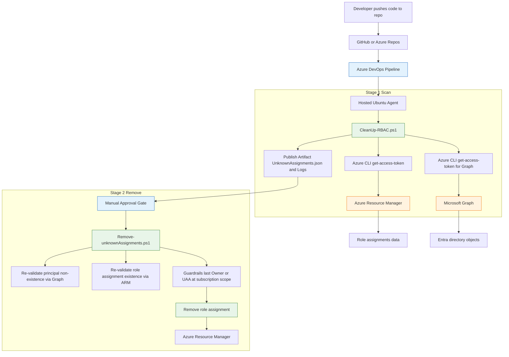
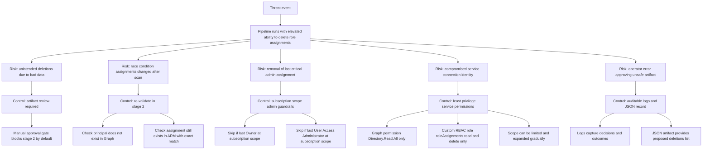

# Security Policy

## Overview

This repository contains automation that **detects and remediates orphaned Azure RBAC role assignments** using Azure DevOps pipelines and PowerShell.

Because the solution is capable of modifying access control at **subscription and management group scope**, it is treated as **security-sensitive infrastructure automation** and is designed in alignment with:

- Microsoft **Cloud Adoption Framework (CAF)** – Secure methodology  
- Microsoft **Well-Architected Framework** – Security pillar  
- **Australian Cyber Security Centre (ACSC) Essential Eight** (Restrict Administrative Privileges)

This document describes the security posture, safeguards, and operational expectations for this project.

---

## Security Design Principles

### Least Privilege by Design

The Azure DevOps service connection operates with **minimal required permissions**:

- Microsoft Graph:  
  - `Directory.Read.All` (read-only, used solely to validate identity existence)
- Azure RBAC:
  - A **custom role** scoped to read and delete role assignments only
  - The **Reader** role to allow enumeration of all subordinate resources.

```json
{
  "actions": [
    "Microsoft.Authorization/roleAssignments/read",
    "Microsoft.Authorization/roleAssignments/delete"
  ],
  "notActions": [],
  "dataActions": [],
  "notDataActions": []
}
```

This aligns with Microsoft CAF guidance on **minimising standing privilege** and **explicit authorisation**.

References:

- CAF Secure overview: <https://learn.microsoft.com/en-us/azure/cloud-adoption-framework/secure/overview>
- CAF Security principles: <https://learn.microsoft.com/en-us/azure/cloud-adoption-framework/strategy/inform/security>

---

### Explicit Verification (Zero Trust)

All RBAC removals require **explicit validation**:

1. The Microsoft Entra ID object **no longer exists**
2. The Azure RBAC role assignment **still exists**
3. The role assignment parameters (scope, role definition, object ID) **match exactly**

No assumptions are made based on cached data or prior scans.

This implements the CAF Zero Trust principle of **“Verify explicitly”**.

---

## Dual-Safeguard Removal Logic

The pipeline applies **two independent layers of protection** before any RBAC removal occurs.

### 1. Pipeline-Level Safeguards

- Orphaned assignments are exported to a **JSON artifact**
- A **manual approval gate** is required before deletion
- The reviewer must explicitly approve the execution of the removal stage

This ensures:

- Human review of proposed changes
- Protection against logic or data errors
- Auditable decision-making

---

### 2. Script-Level Safeguards

At runtime, the removal script performs **real-time validation**:

- Re-checks Microsoft Graph to confirm the principal still does not exist
- Re-checks Azure RBAC to confirm the assignment still exists
- Skips deletion if conditions are no longer met

Additionally, Azure platform guardrails prevent:

- Deletion of the **last Owner** at subscription scope
- Deletion of the **last User Access Administrator** at subscription scope

Such cases are logged and must be remediated manually if required.

---

## Alignment with ACSC Essential Eight

This solution supports the following **ACSC Essential Eight** mitigation strategies:

### Restrict Administrative Privileges

- Automated identification of stale RBAC assignments
- Removal of unnecessary administrative access
- Reduction of attack surface caused by orphaned identities

Reference:

- ACSC Essential Eight overview: <https://learn.microsoft.com/en-us/compliance/anz/e8-overview>

While Essential Eight is endpoint-focused, the principle of **limiting administrative access** applies directly to cloud IAM governance.

---

## Auditability and Logging

All actions are fully auditable:

- Structured logs record:
  - Scan scope
  - Orphan detection logic
  - Removal decisions
- Logs are published as pipeline artifacts
- JSON output provides a clear before/after record of changes

This supports:

- Incident investigation
- Compliance reviews
- Post-change validation

---

---

## Security Architecture (Mermaid)



This diagram shows the control-plane flow from repository trigger through the two-stage pipeline, including token retrieval via Azure CLI, artifact generation, manual approval, and guarded deletion of role assignments.

---

## Threat Flow (Mermaid)



This diagram describes common threat scenarios and the corresponding mitigations implemented by the pipeline approval gate, runtime validation, least-privilege permissions, and Azure guardrails.

## Threat Model Considerations

### Primary Risks Addressed

- Accumulation of orphaned RBAC assignments
- Privilege persistence after identity deletion
- Over-privileged service principals
- Human error during manual cleanup

### Risk Mitigations

| Risk | Mitigation |
| --- | --- |
| Accidental privilege removal | Manual approval + runtime validation |
| Race conditions | Re-validation at deletion time |
| Excessive service permissions | Custom RBAC role |
| Loss of admin access | Azure platform guardrails |

---

## Operational Expectations

- The pipeline **should first be run in non-production environments**
- JSON artifacts **must be reviewed before approval**
- Custom role scope should be expanded gradually (subscription → management group)
- Any bypasses or exclusions should be documented and reviewed periodically

---

## Reporting Security Issues

This repository is currently maintained by a single author.

If a security issue is identified:

- Do **not** open a public GitHub issue
- Instead, raise the issue through internal security or platform governance channels

---

---

## Responsible Disclosure

### Security Issue Reporting

This repository contains automation that operates on **Azure identity and access control (RBAC)** at subscription and management group scope. As such, security issues related to this project may expose **control-plane risks** if discussed publicly before mitigation.

To support responsible disclosure and minimise risk:

- **Do not open public GitHub issues** for suspected security vulnerabilities.
- Security concerns should instead be raised through **internal security, identity, or platform governance channels** appropriate to the consuming organisation.

This approach ensures that:

- Potential vulnerabilities are not disclosed prematurely
- Mitigations can be assessed and applied safely
- Remediation actions can consider tenant-specific guardrails and governance controls

---

### Disclosure Principles

Security issues are handled in accordance with recognised best practices, including:

- **Controlled disclosure** — limiting exposure until remediation is available
- **Least exposure** — avoiding unnecessary publication of attack paths
- **Context-aware remediation** — recognising that identity and RBAC risks often depend on tenant configuration

These principles align with:

- Microsoft Cloud Adoption Framework (CAF) Secure methodology
- Zero Trust security concepts
- Australian Cyber Security Centre (ACSC) guidance on reducing administrative risk

---

### Scope of Security Issues

Examples of issues appropriate for responsible disclosure include:

- Unexpected RBAC deletion behaviour
- Bypass or failure of validation safeguards
- Privilege escalation paths involving the pipeline or service connection
- Inaccurate detection of orphaned identities

General questions, enhancements, or documentation improvements may still be handled through standard repository discussions where appropriate.

## References

- Microsoft Cloud Adoption Framework:  
  <https://learn.microsoft.com/en-us/azure/cloud-adoption-framework/overview>

- CAF Secure methodology:  
  <https://learn.microsoft.com/en-us/azure/cloud-adoption-framework/secure/overview>

- CAF Security considerations:  
  <https://learn.microsoft.com/en-us/azure/cloud-adoption-framework/strategy/inform/security>

- ACSC Essential Eight:  
  <https://learn.microsoft.com/en-us/compliance/anz/e8-overview>
